# Image stitching

    
   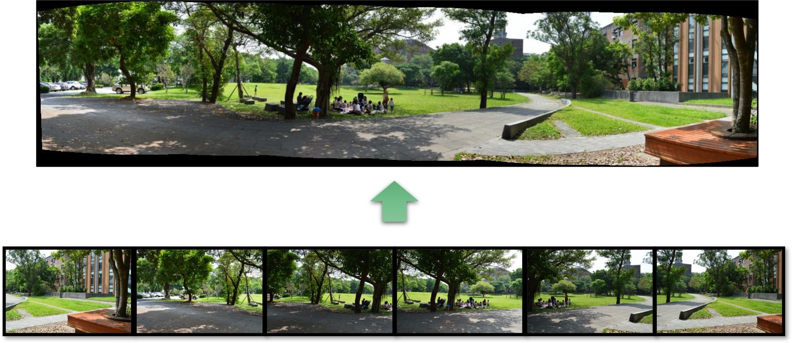
    

# 2_Corner_feature

    
   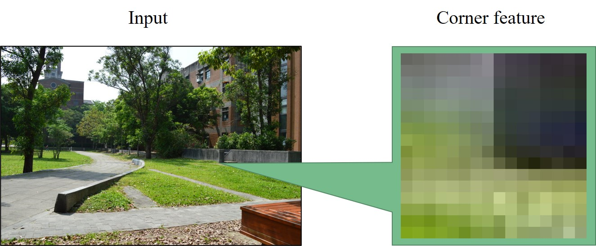
    

# 3_Taylor_series_approximation

    
   
    

# 4_Eigenvalues_determines_instant_changes

    
   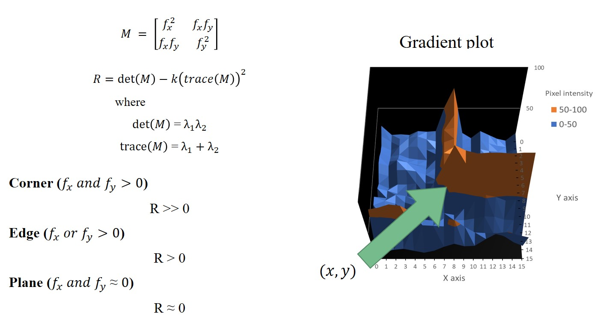
    

# 5_Corner_feature_detected

    
   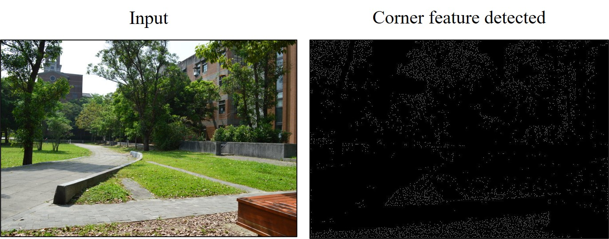
    

# 6_Gradient_8_orientation

    
   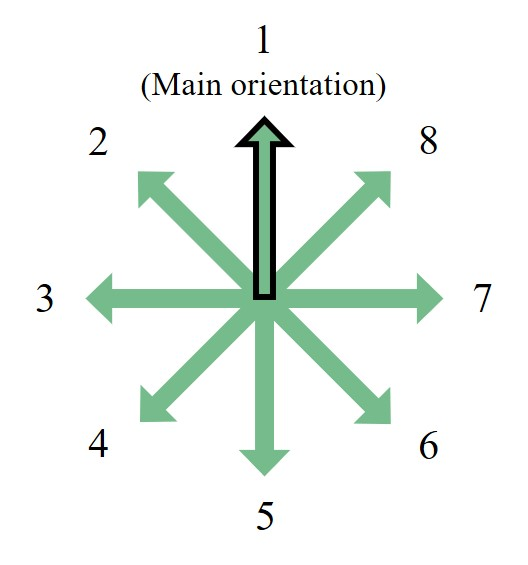
    

# 7_Histogram_of_gradient

    
   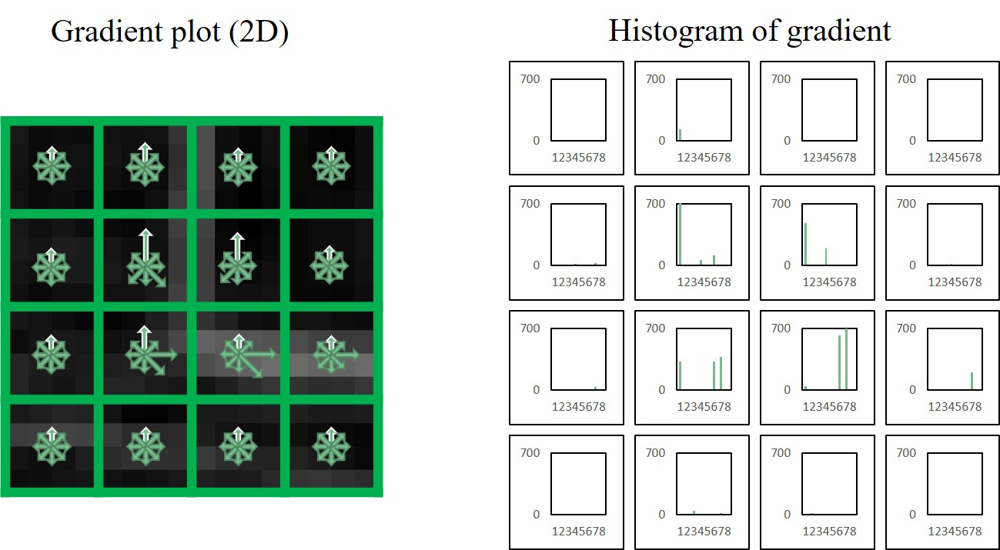
    

# 8_Flatten_form

    
   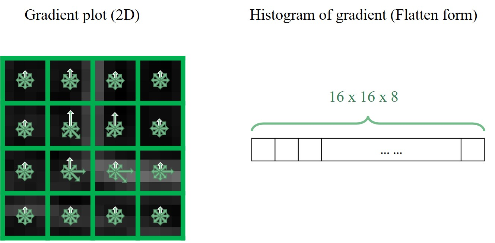
    

# 9_Cylindrical_mapping

    
   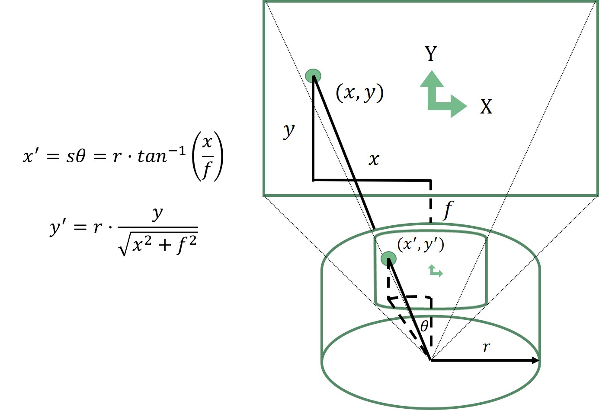
    

# 10_Cylindrical_mapping_with_real_scene

    
   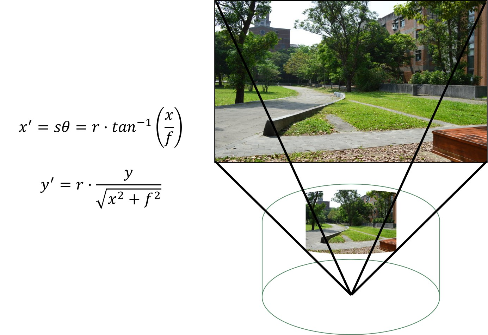
    

# 11_Histogram_of_slope_and_length

    
   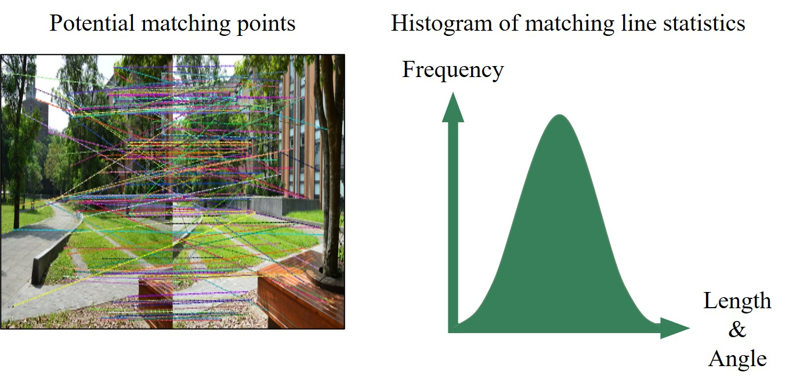
    

# 12_Inlier

    
   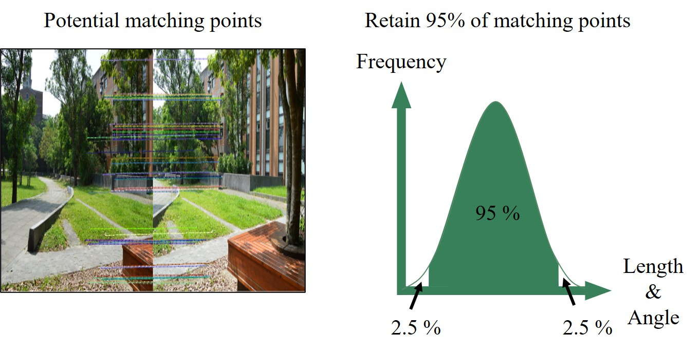
    

# 13_Linear_blending

    
   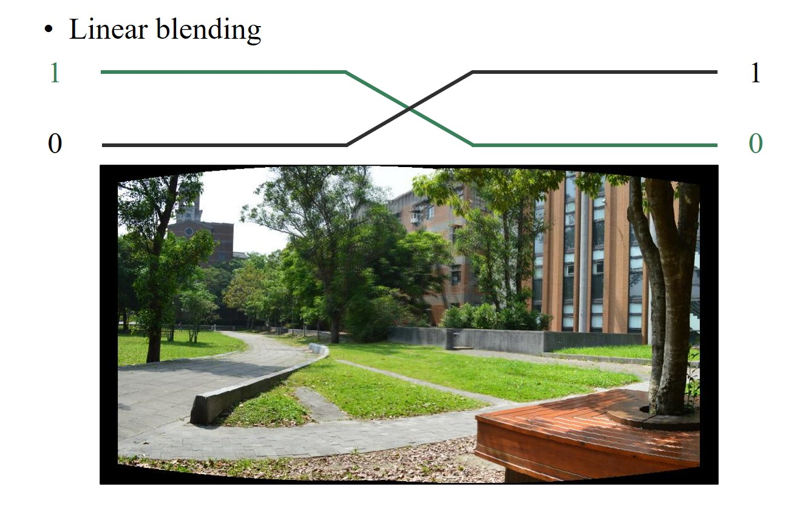
    

# 14_Final_result

    
   
    

