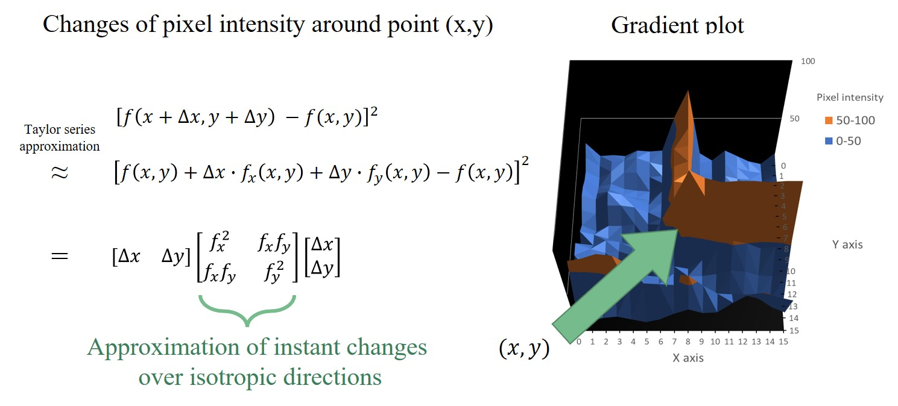

# Image stitching

    
   
    

# Harris corner detection
To have the images stitching together we need to find the corresponding point for each pair of images, although SIFT is a good choice capable to detect feature that is scale invariant, but here since the images are of similar scale and also because Harris method is faster to implement is the main reason we use Harris method.

**Corner feature**  
Here's the graph showing corner feature to be detected, in first glance we could observe that the pixel intensity at the point of corner changes instantly:

    
   
    

**Gradient plot**  
If we calculate the first order derivative over the image, we could even observe the derivatives along plane, edges and corner are distributed in it's own way:

    
   
    

**Taylor series appriximation**  
From the taylor series approximation we could find that the matrix containing first order derivative is indeed determining how instant changes it is around each point:

    
   
    

**Eigenvalues determine instant changes**  
The use of eigenvalues is better than derivatives in the sense that eigenvalue would determines the amount of changes and automatically aligns with the direction of greatest changes, so by analyzing the eigenvalue we could determine whether the current point is a plane, edge or corner:

    
   
    

**Corner feature detected**  
Here's a example of the corner feature detected withiin the image:

    
   
    

# Gradient descriptor
Once the feature has been detected we'll need to describe it, to have the property of orientation invariant SIFT descriptor is using.

**Main orientation**  
To achieve orientation invariant the first step is to calculate the histogram of gradient, and find the main orientation of gradient for each point:

    
   
    

**Histogram of gradient**  
And again calculate the histogram of gradient, this time the orientation is based on the main orientaion:

    
   
    

**Flatten form**  
Once we've finished the calculation of histogram statistics, the next step is to flatten into a vector show in the following graph:

    
   
    

# Feature matching
Here nearest neighbor is used to find the match point for each feature, and some filtering process is needed to provide more accurate result.

**Histogram of slope and length**
In this stage we'll get some potential matching point, the next step is to calculate the histogram for both the slope and length of matching point:

    
   
    

**Inlier detection**

    
   
    

# 9_Cylindrical_mapping

    
   
    

# 10_Cylindrical_mapping_with_real_scene

    
   
    

# 13_Linear_blending

    
   
    

# 14_Final_result

    
   
    

